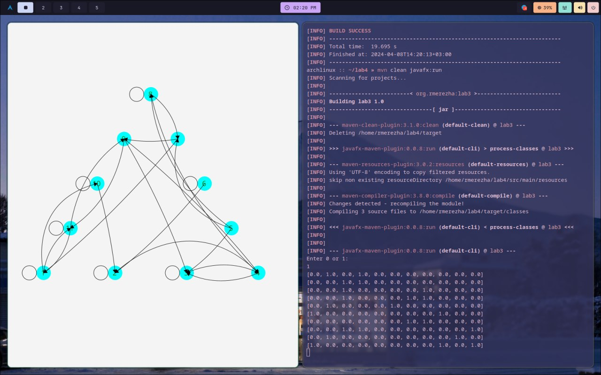
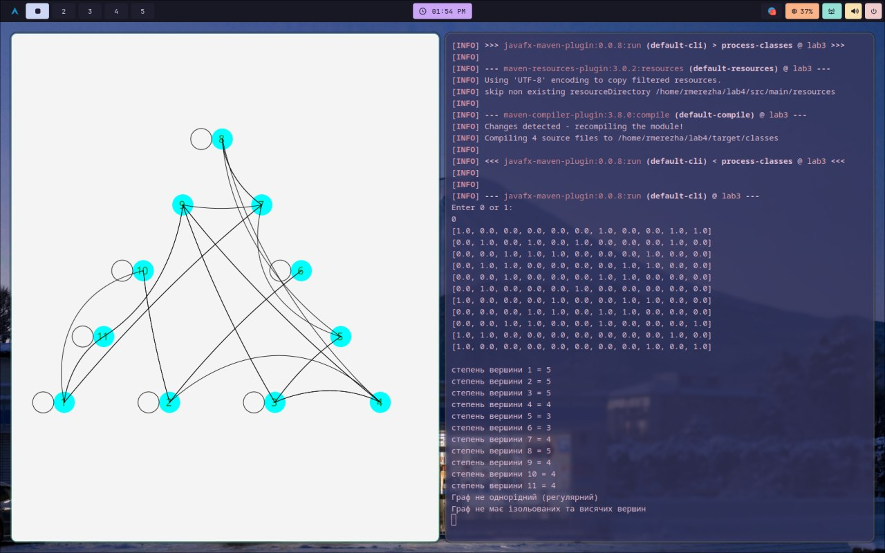
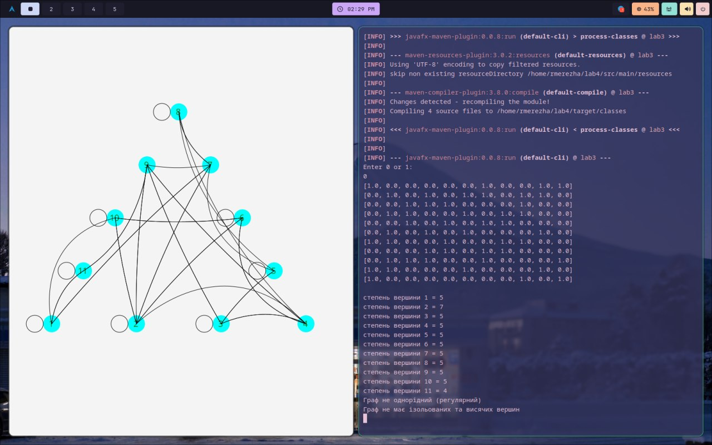
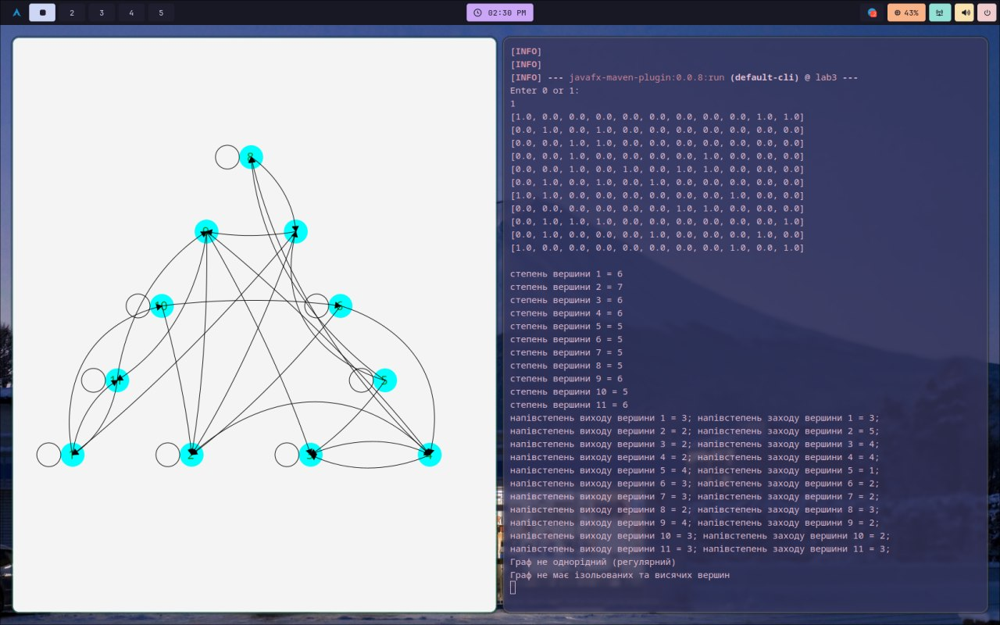
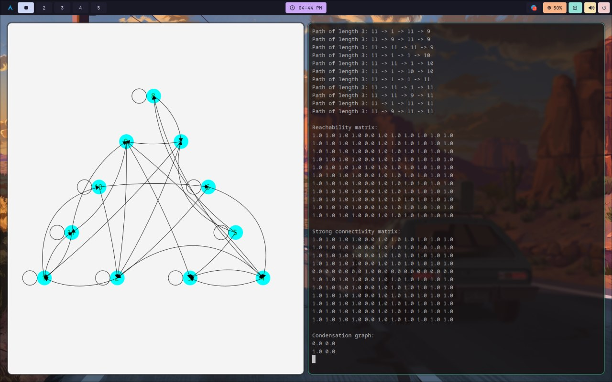

# You need to run : jdk17 & maven

```
git clone https://github.com/rmerezha/lab3.git
cd lab3
mvn javafx:run
```


## Пункт 1:
```
git checkout ef89e8f
mvn javafx:run
```



## Пункт 2:
```
git checkout 4cd019d
mvn javafx:run
```



## Пункт 3:
```
git checkout 14077e7
mvn javafx:run 
```



## Пункт 4:
```
git checkout 60035dd
mvn javafx:run 
```

